# Exercises for programers - solutions
for the unsolved Exercises see [henrikql/yh-oop19](https://github.com/henrikql/yh-oop19/tree/master/Week1).

Solotions also avaible in [php](https://github.com/puggan/oop2019/tree/php).

## Exercises 1 [w1e01.cs](w1e01/w1e01.cs)
Read integers from Console.  
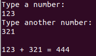

## Exercises 2 [w1e02.cs](w1e02/w1e02.cs)
Calculate Leap-years.  
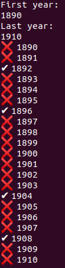

## Exercises 3 [w1e03.cs](w1e03/w1e03.cs)
Palindrome.  
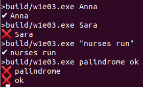

## Exercises 4 [w1e04.cs](w1e04/w1e04.cs)
FizzBuzz.  
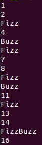

## Exercises 5 [w1e05.cs](w1e05/w1e05.cs)
Guess the number, single-player.  
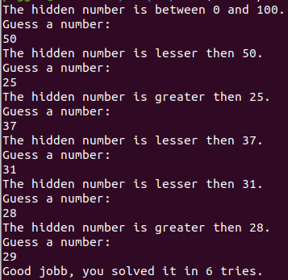

## Exercises 6 [w1e06.cs](w1e06/w1e06.cs)
Guess the number, vs computer.  
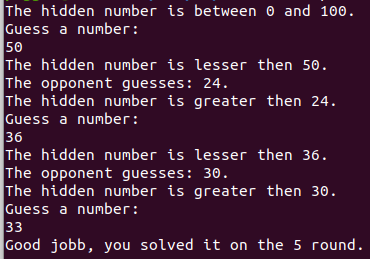

## Exercises 7 [w1e07.cs](w1e07/w1e07.cs)
Loading bars?  

## Exercises 8 [w1e08.cs](w1e08/w1e08.cs)
Christmas Tree.  
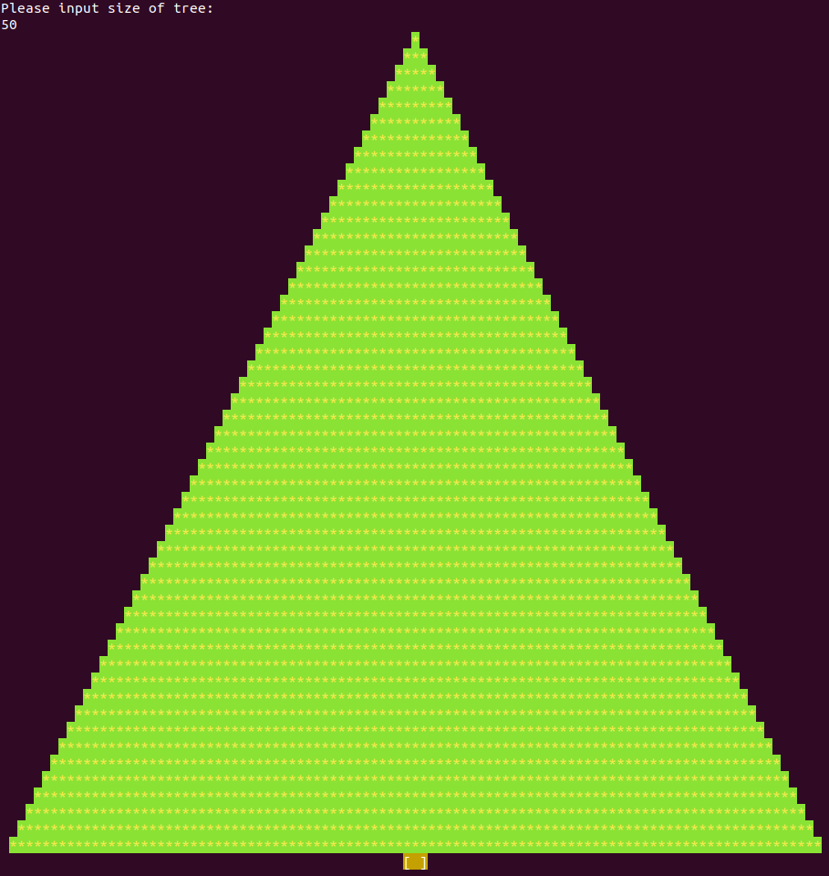

## Exercises 9 [w1e09.cs](w1e09/w1e09.cs)
Map Reader.  
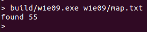

## Exercises 10 [w1e10.cs](w1e10/w1e10.cs)
Invader Reader.  
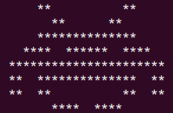

## Exercises 11 [w1e11.cs](w1e11/w1e11.cs)
Math Parser.  
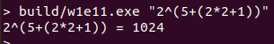

## Exercises 12 [w1e12.cs](w1e12/w1e12.cs)
Tetris Rotation.    
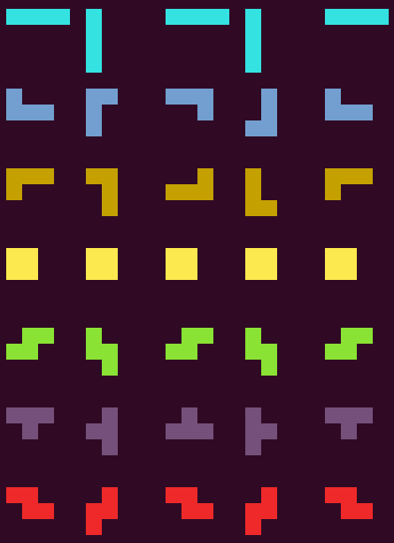

## Exercises 13 [w1e13.cs](w1e13/w1e13.cs)
Tetris Bag.  
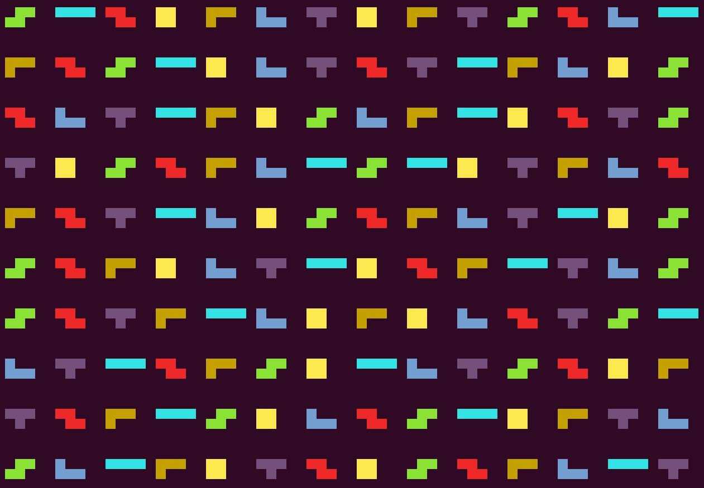

# Week 2

## Exercises 1 (Week 2) [w2e01.cs](w2e01/w2e01.cs)
White Boxes.  

## Exercises 2 (Week 2) [w2e02.cs](w2e02/w2e02.cs)
Colored Boxes.  

## Exercises 3 (Week 2) [w2e03.cs](w2e03/w2e03.cs)
Centered Boxes.  

## Exercises 4 (Week 2) [w2e04.cs](w2e04/w2e04.cs)
Random Boxes.  
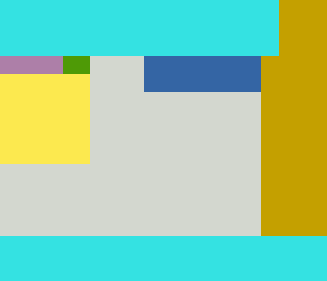
